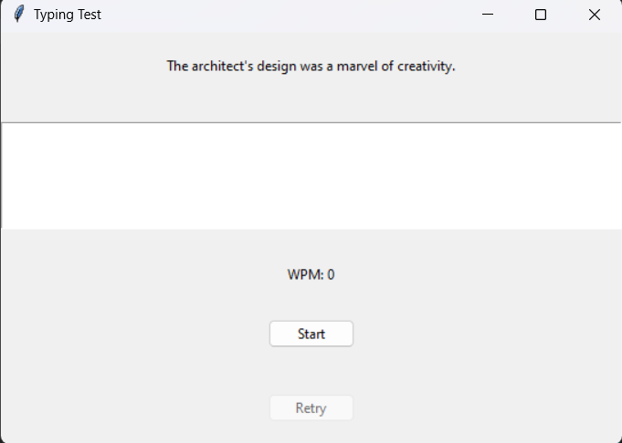

# Typing Test Application

Test your typing speed with this interactive and user-friendly application built using Tkinter in Python.

## Details

The application provides a platform for users to challenge their typing speed. It picks a random sentence from `text.txt` and evaluates the user's typing accuracy and speed in words per minute.

### Prerequisites

- Python
- Tkinter (usually comes with Python standard library)
- `text.txt` file containing sentences for the test.
- Install any external dependencies with pip: pip install -r requirements.txt

## Features
- Random sentence selection for diverse typing challenges.
- Real-time error highlighting during typing.
- Calculates Words Per Minute (WPM) after completion.
- Intuitive and clean GUI for user-friendly experience.

## Getting Started
1. Clone the repository: git clone https://github.com/Bisalkumar/Typing_Test.git
2. cd Typing_Test
3. Run the application: python main.py

## How to Use
- Press the "Start" button or the Enter key to begin the test.
- Type the displayed sentence.
- Upon completion, your typing speed in WPM will be displayed.
- Click "Retry" to attempt another sentence.

## Screenshots

## Contributions
Want to contribute? Great!

## License
This project is licensed under the MIT License - see the LICENSE.md file for details.

## Acknowledgements
Thanks to Google and Youtube for assisting in refining the application.